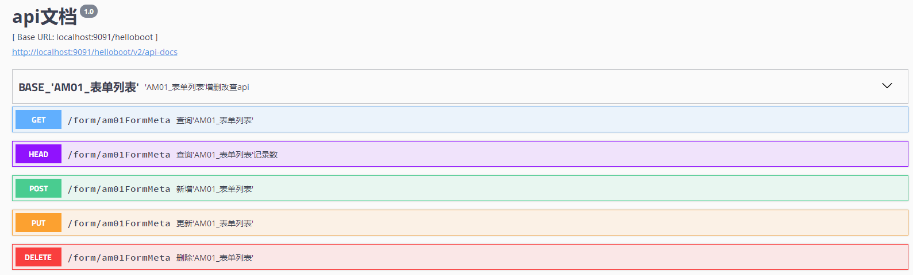

## 1. 工程目录说明
```html
├─java
│  └─com
│      ├─boot
│      │  ├─aoplistener        AOP事件监听和处理
│      │  ├─common             通用类，数据统一封装，统一异常类等
│      │  ├─config             基于springboot的不同配置类
│      │  ├─constant           统一参数配置，全局变量
│      │  ├─eventlistener      事件监听和处理
│      │  ├─module             模块目录，根据模块创建对应子目录
│      │  │  ├─sys             系统模块（通用错误处理，业务相关的工具类等）
│      │  │  │  ├─controller   
│      │  │  │  └─service
│      │  │  ├─datatables      配合前端datatable.js插件使用，包含分页查询等
│      │  │  ├─auth            权限验证模块，基于shiro实现
│      │  │  │  ├─controller   用户登录，权限分配等
│      │  │  │  ├─principal    shiro认证类
│      │  │  │  └─service
│      │  │  ├─file            文件操作模块
│      │  │  │  ├─controller
│      │  │  │  └─service
│      │  │  ├─form            form表单生成模块
│      │  │  │  ├─controller
│      │  │  │  └─service
│      │  │  ├─general         常用模块（数据字典等）
│      │  │  │  ├─controller   
│      │  │  │  └─service
│      │  │  ├─*##*            其他模块，根据需要对模块进行规划
│      │  │  │  ├─controller
│      │  │  │  └─service
│      │  │  └─websocket       websocket模块
│      │  │      ├─controller
│      │  │      └─service
│      │  ├─repository         数据库存储相关，所有与domain相关的po、vo、dao、qo在此目录下
│      │  │  └─common          ID生成器和JPA解析操作
│      │  ├─scheduler          定时器
│      │  ├─utils              非业务相关的工具类
│      │  └─web                
│      │      ├─filter         过滤器
│      │      ├─init           系统初始化
│      │      └─listener       监听器        
│      └─codegen               代码生成器（已拆出）
└─resources                    如果前后端分离，则此目录不需要
    ├─META-INF
    └─static
        ├─css
        ├─img
        ├─js
        ├─page
        └─plugins
```

## 2. 数据库创建规则

1. 数据库表名称和字段名称必须为字母或数字，字母大写，可用“_”分隔单词，字段名不能以数字开头。
2. 数据库表名称以`两位字母+两位数字_表说明`格式命名，如：AF01_FILE_STORE，其中前两位字母用于分类，表示表的作用模块（`A开头的表为系统预留，业务相关表名称，首字母不能以A开头`）。
3. 数据表中必须有以下字段:
   - `ID`:为20位字符型，设置为主键key，为字符类型。
   - `OPR_CRT_TIME`:记录创建时间 datetime类型，不需要设置默认时间，由程序在创建时分配。
4. 关于数据表中的时间类型，原则上不使用时间戳（timestamp）类型，以MYSQL为例，可使用以下两种时间类型：
   - Date型（用于存储年月日）
   - DateTime型（用于存储年月日时分秒）
## 3. 开发规范

1. Java命名规则

   - 数据库实体映射类必须以`PO`为结尾，由系统自动生成，仅当后台数据库变化时，才允许对PO、VO、QPO做相应修改。
   - 向前端传输的POJO类必须以`VO`为结尾，由系统自动生成，用户可根据需要添加需要的VO类，但不要修改和删除自动生成的VO类。
   - Q***PO类为QueryDSL使用，与PO类字段基本一致，默认不需要做修改。

1. module目录（模块）下应为每个功能模块单独创建目录，目录中至少应当包含controller，sevice文件夹，sevice下应为业务接口和接口实现类（接口实现类放入impl目录下），接口命名以`I`开头，接口实现类以`Impl`结尾。controller类以`Ctl`结尾。

1. sevice服务的类注解@Service必须加value参数，如：使用@Service("am01FormMetaService")，而不是只写做@Service。当自动注入Sevice时，使用@Resource(name = "customNativeSqlService")方式添加注解，而不是使用@Autowired。

   - 通过`Resource+名称`的注入方式，在IDE中可通过`Ctrl+点击跟踪到具体的接口实现类，而不是定位到接口。

   ```java
   //service类声明
   @Service("af01FileStoreService")
   public class Af01FileStoreServiceImpl extends BaseService implements IAf01FileStoreService {……｝
       
   //注入service
   @Resource(name = "af01FileStoreService")
   private IAf01FileStoreService af01FileStoreService;
   ```

1. service服务类，必须扩展类`BaseService`，BaseService已注入EntityManager和JPAQueryFactory，根据需要使用。

1. VO、PO、QO和基础的增删改查service、controller由代码生成器自动生成，可根据需要在生成的service和controller上进行方法扩展，但不要修改自动生成的代码。

1. DAO若无特殊查询，不需要更改，若需要扩展，可通过以下方式进行（优先使用jpa配置的方式）：
   * 通过使用Spring-data-jpa配置方法名实现，具体配置方式参考`com.boot.repository.Au01UserDAO`类中的`findByUserName ；以下为jpa方式配置说明。
     

   * QueryDSL方式，具体可参照网上资料。示例如下(更新操作)：

     ```JAVA
     //以下对库中id在ids列表中的记录进行修改
     //其中QAm02FormMetaItemPO类为系统自动生成
     public Integer removeEntity(List<String> ids) {
             QAm02FormMetaItemPO qpo = QAm02FormMetaItemPO.am02FormMetaItemPO;
             return Long.valueOf(queryFactory.update(qpo).where(qpo.id.in(ids))
                     .set(qpo.metaDes, "描述")
                     .set(qpo.oprCrtTime, new java.sql.Date(System.currentTimeMillis()))
                     .execute()).intValue();
         }
     ```

   * 除以上两种方式外，可以通过写JPQL（与HQL相似）或原生SQL的方式进行扩展查询，在DAO类中通过以下几种方式实现数据库操作。

     ```java
     //基于实体PO的方式查询，不支持复杂查询
     @Query("from Uc08DataDictEntity u where dictCode = ?1")
     List<Uc08DataDictEntity> findTest1(String dictCode);
     
     //原生SQL方式，不推荐使用，可通过界面配置后，通过URL调用来查询,见下一章节
     @Query(value="select * from uc08_data_dict u where dict_code = :first and application_code =:appCode", nativeQuery = true)
     List<Uc08DataDictEntity> findTest2(@Param("first") String dictCode, @Param("appCode") String appCode);
     
     //更新操作
     @Modifying
     @Query("update Uc08DataDictEntity set applicationCode = ?1")
     int dictUpdate(String appCode);
     
     ```

1. 不要在controller和service中拼接SQL，SQL语句只可以出现在DAO类中，原生SQL查询，可在提供的管理界面上通过配置SQL实现，可通过`http://XXX/项目名称/general/sqlQuery?sqlCode=***`方式调用查询语句。

   

   配置规则如下：

   -  使用`:参数名`的方式替换jdbc中的 `?`，如：select user_name from table_name where user_id=:userid，其中`:userid`为调用url时传入的参数名称，如：XXX/sqlQuery?sqlCode=XXX&`userid=aaa`。
   -  若sql中使用`like`过滤查询，则配置如下：select user_name from table_name where user_id like `% :regx %`，其中`:regx`前后需要加空格。
   -  若sql中使用`in`过滤查询，则配置如下：select user_name from table_name where user_id in (:userids)，其中:userids前台传入时，url传入多个userids参数，如：XXX/sqlQuery?sqlCode=XXX&`userids=aaa&userids=bbb`，则userids会在后台将userids封装为list传给sql。
   -  执行结果返回时，会将数据库中字段名转换为`通用格式（下划线去除，名称首字母小写，单词首字母大写）`输出，如：库中字段名为USER_NAME，返回结果为userName。
   -   其他使用规则，请搜索Spring NamedParameterJdbcTemplate的配置。 

1. VO用于页面展示，作用是对PO进行敏感字段过滤，或多个PO组装成一个VO提供给前台。自动生成的VO与PO属性名相同，PO的date、datetime类型，在VO中加上`@JsonFormat(locale="zh", timezone="GMT+8", pattern="yyyyMMddHHmmss")`的注解，目的是将Date类型转为String类型向前端输出，默认生成的格式为yyyyMMddHHmmss类型，若数据库中为Date型，可手工修改为yyyyMMdd。前台通过URL传入的CURD参数也参照此种格式。

   > PO中用户表有密码，但传给前台时（VO），密码置空，过滤敏感字段；
   >
   > 用户表由用户基本信息（userPO）和用户权限信息(rolePO)组成，多个PO组装为一个VO向前台返回。

1. 为保持一致性，向前端返回的对象必须封装为`HttpOutMsgBean`对象。

1. 日志使用@slf4j注解形式引用日志类，通过在类上添加@slf4j注解（引入lombok.jar，见10.1章节），在需要生成日志处，直接调用log.error/log.info方法生成日志，log实例由@slf4j负责注入。

## 4. 数据的增删改查

###  4.1 Query 

​	查询通过[GET]方式提交。

​	通过代码生成器，项目已自动生成基本的查询，可通过URL传参来查询数据，通过URL调用时，如果需要过滤，则将PO类中的属性名做为参数名传入，系统将传入的参数做为过滤条件进行解析并查询。

​	如，用户信息PO类(Au01UserPO)，包含以下属性：

```java
/**
 * 登录用户名
 */
@Column(name = "USER_NAME", nullable = true, length = 20)
private String userName;

/**
 * 创建时间
 */
@Column(name = "OPR_CRT_TIME", nullable = true, length = 19)
@CreatedDate
private Date oprCrtTime;

```

> 查询时，PO的类名Au01UserPO，URL查询时使用转换后的名称au01User，转换规则为首字母小写，去除PO后缀。
>
> 名称转换规则：数据库表名称AU01_USER，下划线去除，名称首字母小写，单词首字母大写。

        1. 根据用户名过滤查询
         	查询用户名为ABC的记录：
              [GET]   /XXX/au01User?userName=ABC
            查询用户名为ABC(EQ可省略)的记录：
              [GET]   /XXX/au01User?userName.EQ=ABC
            查询用户名以A开头的记录(like 'A%')：
              [GET]   /XXX/au01User?userName.ST=A
            查询用户名以C结尾的记录(like '%C')：
              [GET]   /XXX/au01User?userName.ED=C
            查询用户名包含B的记录(like '%B%')：
              [GET]   /XXX/au01User?userName.LK=B
            查询用户名为A或B的记录
              [GET]   /XXX/au01User?userName.EQ=A&userName.EQ=B&op=OR
              解析后：  where userName='A' or userName= 'B'
              [GET]   /XXX/au01User?userName.IN=A&userName.IN=B   
              解析后：  where userName in ('A','B')
        2.根据创建时间过滤查询
             如用户创建时间字段oprCrtTime为日期类型，查询示例如下：
             查询创建时间为2018-11-01 12:01:01的用户： 
              [GET]   /XXX/au01User?oprCrtTime=20181101120101
             查询创建时间大于2018-11-01的用户： 
              [GET]   /XXX/au01User?oprCrtTime.GT=20181101
             查询创建时间大于2018-11-01并且小于2018-11-10的用户： 
              [GET]   /XXX/au01User?oprCrtTime.GT=20181101&oprCrtTime.LT=20181110
        3.多条件综合查询
             多条件查询时，各条件之间默认为AND关系，若添加op=OR参数，则为或查询。
             如：查询用户名以A开头或以C结尾的用户：
              [GET]   /XXX/au01User?userName.ST=A&userName.ED=C&`op=OR`
              解析后： where userName like 'A%' or userName like '%C'


        参数后缀说明
          "EQ":  //等于
          "NEQ": //不等于
          "GT":  //大于
          "LT":  //小于
          "GE":  //大于等于
          "LE":  //小于等于
          "LK":  //LIKE         日期类型不支持此后缀
          "ST":  //开始于        日期类型不支持此后缀
          "ED":  //结束于        日期类型不支持此后
          "NLK": //NOT LIKE     日期类型不支持此后
          "NST": //不开始于       日期类型不支持此后缀
          "NED": //不结束于       日期类型不支持此后
          "NU":  //IS NULL       参数任意，仅查询数据库中为NULL的数据，空字符值（""）的记录不返回，查询为“”的记录，使用'XX.eq='，=后不加任何字符。
          "NNU": //IS NOT NULL   参数任意，仅查询数据库中不为NULL的数据，空字符值（""）的记录也会返回
          "IN":  //IN            /XXX/au01User?userName.IN=A&userName.IN=B
          "NIN": //NOT IN        /XXX/au01User?userName.NIN=A&userName.NIN=B
#### - OR查询

​	查询时，除将PO类中的属性做为参数名传入外，还有以下几个特殊参数：

```
op：用于操作查询是AND还是OR，当且仅当op=OR时，查询为OR关系。
如查询用户名为ABC或为CD的记录：
   [GET]   /XXX/au01User?userName=ABC&userName=CD&op=OR
```

#### - 分页查询

​	若进行分页查询，通过URL传入分页参数(page、size、sort)，其中page和size必须同时出现，sort可为空。page和size任一为空，则不分页。

```
page: 第几页,从0开始，若为空，则不分页；
size: 每一页的行数，若为空，则不分页；
sort: 排序字段,可为空，以property;property(,ASC|DESC)的方式组织，如sort= firstname;lastname,desc 表示在按 firstname 正序排列基础上按lastname倒序排列。
	如：查询创建时间在20181101和20181110之间的数据，按operCrtTime倒排序，取第1页的10行记录：
	[GET]   /XXX/au01User?oprCrtTime.GT=20181101&oprCrtTime.LT=20181110&page=0&size=10&sort=oprCrtTime,desc
```

#### - 记录数查询

​	记录数查询通过[HEAD]方式提交，查询参数同QUERY查询相同。

```
  [HEAD]   /XXX/au01User?userName=ABC&userName=CD&op=OR
  解析为：  select count(*) from AU01_USER where userName='ABC' or userName = 'CD'
```

### 4.2 Update & Insert 

​	更新和插入均通过[POST]方式提交，当数据库存在此ID时，则更新ID相同的记录，若库中无此ID记录，则做为新行插入（自动生成新ID）。

	[POST]：  /XXX/au01User
	data： [{
	    "id": "1",
	    "userNameCn": "ONE_CNA",
	    "userName": "ONEA",
	    "password": "ONEP",
	    "phoneNumber": "",
	    "email": "",
	    "userAskKey": "567d2233-df77-11e8-b278-0021ccb90db0",
	    "userExtend": "",
	    "accountExpired": "N",
	    "accountLocked": "N",
	    "accountEnabled": "Y"
	}]

​	通过ajax提交时，需要使用JSON.stringify将对象转为字符型。

​	提交的内容应该为对象列表（==即后端程序接收的是一组记录列表==），若只更新或插入一条记录，则需要在数据前后加'['和']'。

### 4.3 Delete

​	删除数据通过[DELETE]方式提交，参数内容为要删除记录的id列表。

```` 
  [DELETE]：  /XXX/au01User
  data： ['id1','id2']
````

​	通过ajax提交时，需要使用JSON.stringify将对象转为字符型。提交的内容应该为对象列表，若只需要更新或插入一条记录，需要在数据前后加'['和']'。

### 4.4 时间字段的处理

​	日期字段的增删改查，通过前台URL传入后台，后台判断某字段为日期格式，会自动识别并转为日期类型，可使用以下几种规则传入日期的字符串格式，但建议只使用yyyyMMdd和yyyyMMddHHmmss格式。

   ```java
 yyyy-MM-dd
 yyyy-MM-dd HH
 yyyy-MM-dd HH:mm
 yyyy-MM-dd HH:mm:ss
 yyyyMMdd
 yyyyMMddHH
 yyyyMMddHHmm
 yyyyMMddHHmmss
   ```

### 4.5 ID生成

​	后端程序会自动生成记录的ID字段用于数据库存储，ID生成策略为雪花算法，生成12-13位的唯一ID，为保证前后端生成ID的格式一致，前端生成ID时，调用js代码`_SnowflakeIdGenerator.nextId()`生成。

​	一般情况下，前端js不需要生成记录的ID字段，由后台自动分配即可；当前端生成了一条记录，后续要使用到ID字段用来加载数据，此时可由前端负责ID生成。

​	后端程序会判断前端传入的记录，若传入记录没有ID字段，则后端生成，若前端有ID字段，则保持前端ID不变。

## 5. 获取实体表的元数据

​	获取各实体表或自定义form表单的配置（配合custom-form-meta.js使用），通过调用`meta/{formCodes}`获取，如果一次要获取多个，则`formCodes`使用逗号分隔，返回结果使用`data.msgContent.{formCode}.formItems`获取，formCode为传入formCodes列表中的其中一个值。如下：

   ```javascript
       $.ajax({
           type: "GET",
           async: true,
           url: "meta/au01User,au02Organization,au03Role",
           success: function (data) {
               _formUser = data.msgContent["au01User"].formItems;
               _formOrg = data.msgContent["au02Organization"].formItems;
               _formRole = data.msgContent["au03Role"].formItems;
           }
       });
   ```

## 6. 文件上传下载

​	参考类com.boot.module.file.controller.Af01FileStoreCtl。

​	文件上传：[POST] /file/upload，参数为MultipartHttpServletRequest，一般前端js上传控件均支持，建议dropzone.js。

​	前台上传文件时，若js控件支持修改传输中的文件名，则将文件名修改为fileId|name格式，fileId即为文件存储时的fileId，也是文件下载时的传入参数fileId。

​	文件下载：[GET] /file/download，参数为fileId和fileName，其中fileName可空。

## 7. Websocket使用

略

## 8. 事件监听

事件监听有以下作用：

  - 在多个操作结束以后，都需要调用另外同一个操作时。如，修改组织机构、角色、用户时都需要刷新权限，则可将刷新权限的操作提取出来；在修改组织机构、角色、用户时，发布事件，通知刷新权限操作执行。
  - 可以对业务进行逻辑隔离，不需要在一个模块内嵌入另一个模块的逻辑代码，只需要发布事件即可，不需要关心最终会触发什么操作。

### 8.1 EventListener

使用方式参照类com.boot.module.auth.service.impl.Au04PrivilegeServiceImpl。

需要实现两个类，一个为扩展自ApplicationEvent的类，本例中为PrivilegeChangeEvent，无业务逻辑；另一个为具体执行事件的类，本例中为PrivilegeChangeEventListener，逻辑均在此类中实现。


### 8.2 AOPListener

与EventListener的作用相同，不同点在于使用注解方式触发事件，并且只需要实现一个扩展自IEventListener的监听类。	

使用方法：
​	1、在需要监听触发的方法上添加@CusAnnotation(behaviorDes="XXX")注解。其中XXX表示要执行的监听类。
​	2、编写监听类实现IEventListener接口，当配置注解的方法执行时，会调用此实现类中的方法执行。
注意：
​	由于基于反射生成类，因此无法在IEventListener通过@Autowired实现注入Bean或Service,可使用 	SpringBeanTools.getBean方式获取到service

## 9. 关于PO、VO转换

​	本工程现有PO、VO转换均使用com.boot.module.sys.ConvertBeanTools中的方法实现，仅适用于参数名称和类型相同的转换，若有更复杂的转换，可以通过编写代码或使用mapstruct框架实现。	

## 10. 其他组件

### 10.1 Lombok

 > `Lombok` 是一种 `Java™` 实用工具，可用来帮助开发人员消除 Java 的冗长，尤其是对于简单的 Java 对象（POJO），它通过注解实现通用代码生成。
1. IDE设置，需要对IDEA进行以下配置：
   - 安装`lombok plugin`插件
     
1. 使用方法：
   - 日志记录，通过在类上注解@Slf4j实现，注解后，可直接使用log.error，log.info等进行日志记录。
   - JAVA类，通过在类上加@Data注解，生成setter,getter,equels, toString等方法。
   - 其他的注解，请参照官网。 

### 10.2 API文档

​	项目使用Swagger2自动api生成，访问地址为`http://XXX/项目名称/swagger2`



### 10.3 QueryDSL

​	QueryDSL方式查询数据库

​	参考 http://www.querydsl.com/static/querydsl/latest/reference/html/ 

## 11. 前端组件

### 11.1 Form表单生成

### 11.2 DataTables


使用方式参照dictionary_admin.html，其他函数参考custom-dataTables.js。

通过以下方式生成表格：

​	_builderDataTab(partentDivId, tabObj, customOption, editDataFunc, delDataFunc, addDataFunc) ;

其中：

- 参数partentDivId：在此ID元素下生成表格
- 参数tabObj：表的元数据信息，数据来源参见“第5章、获取实体表的元数据”。
- 参数customOption：对表格的操作配置
- 函数参数editDataFunc：编辑一行记录时，调用此函数
- 函数参数delDataFunc：删除一行记录时，调用此函数
- 函数参数addDataFunc：添加一行记录时，调用此函数


```javascript
//参数配置如下：
var customOption:{
    "tabClass":"table-bordered",//用于在表格上添加class属性
    "globalSearch":"N",//是否显示全局搜索框(右上角的全局搜索)，后台分页时，此功能无用
    "hasFooter":"Y",  //是否显示底部标题(仅为标题，非sum求和)
    "ajaxUrl": "GET:wordcode/wcodeList.html?wcodeGroupName=TESTWCODE",//数据来源,可为空，为空表示只将页面上的内容进行格式化，不加载数据。需要加上GET、POST等前缀，如果不加则默认为GET
    "ifExp":"Y"  //是否导出
    "fileName":""  //导出文件名
    "ifEdit":"Y"  //是否显示修改按钮
    "ifDel":"Y"  //是否删除;
    "ifAdd":"Y" //是否增加,
    "ifServerPage":"Y" //是否后台分页，Y：通过ajaxurl查询数据，后台分页；N一次性通过ajaxUrl加载数据后前台分页。
    "addRowsDefVal":{dictDes:"aaaa",dictName:"bbbb"} //添加行时的默认值，当某些字段不可见或不可编辑，但又必填时填充值
    "filterFields":["字段1","字段2"] //生成过滤字段，字段名称即为tabObj中的metaCode
 }

//示例：后台分页
var customOption = {
       "tabClass": "table-bordered",
       "hasFooter": "N",
       "ajaxUrl": "GET:datatables/am02FormMetaItem",
       "ifExp": "Y",
       "fileName": "文件名",
       "ifEdit": "Y",
       "ifDel": "N",
       "ifAdd": "Y",
       "ifServerPage":"Y",
       "addRowsDefVal":{dictDes:"aaaa",dictName:"bbbb"},//添加行时的默认值
       "filterFields":["metaHtmlType", "metaCode"]
   };
//示例：前台分页
var customOption2 = {
       "tabClass": "table-bordered",
       "globalSearch":"Y",//右上角的全局搜索
       "hasFooter": "N",
       "ajaxUrl": "GET:form/am02FormMetaItem",
       "ifExp": "Y",
       "fileName": "文件名",
       "ifEdit": "Y",
       "ifDel": "N",
       "ifAdd": "Y",
       "ifServerPage":"N",
       "addRowsDefVal":{dictDes:"aaaa",dictName:"bbbb"},//添加行时的默认值
       "filterFields":["metaHtmlType", "metaCode"]
   };
```

### 11.3 Tree


使用方式参照dictionary_admin.html，其他函数参考custom-tree.js。

通过以下方式生成树型结构：

​	_buildTree(partentDivId, cusTreeSetting, treeObj);

其中：

 - 参数1（partentDivId）：在此ID元素下生成树
 - 参数2（cusTreeSetting）：参数配置
 - 参数3（treeObj）：树节点的数据结构

```javascript
//cusOpt格式
var cusTreeSetting = {
    nodeId:"stdElementId",
    childrenName: "subStdElementList",
    nodeName: "stdElementName",
    ifEdit: true,
    ifAdd: true,
    ifRemove: true,
    ifRename: true,
    addNodeFun: null,//添加节点的函数,有两个参数，2为添加后的节点，1为新加节点的父亲节点
    clickNodeFun: null//点击节点的函数
    beforeRemoveFun,//删除前
    beforeDragFun,//拖拽开始
    onRemoveFun,//删除
    onDropFun,//拖拽结束后
    onRenameFun//重命名
}

//数据格式
var dataJson=
    {
        "stdElementName" : "根节点",
        "stdElementId" : "ed111716-43a6-497c-8937-39c682baf9c8",
        "subStdElementList" : [
            {
                "stdElementName" : "新节点0",
                "stdElementId" : "a3ccd83d-1348-4ee4-81fd-4327ce03a826",
                "subStdElementList" : [
                    {
                        "stdElementName" : "新节点1",
                        "stdElementId" : "f43ec125-f25f-4732-9b39-13c92fa99ae5"
                    }
                ]
            }
        ]
    }
```

### 11.4 LabelTree

​	

使用方式参照organization_admin.html，其他函数参考custom-label-tree.js。

通过以下方式生成树型结构：
​	_buildLabelTree("org_tree", orgTreeSetting, treeObj);

```javascript
let orgTreeSetting = {
    nodeId: "nodeId",
    childrenName: "subNodeList",
    nodeName: "nodeName",
    maxDepth: 5,   //最大深度
    ifEdit: true,  //是否允许编辑
    ifAdd: true,   //是否允许添加节点
    ifRemove: true, //是否允许移动节点
    ifRename: true, //是否允许重命名节点
    addNodeFun: function (node) {},//添加节点的函数
    onRemoveFun: function () {},//删除节点的函数
    onDropFun: function () {},//移动节点的函数
    onRenameFun: null,//重命名
    clickNodeFun: function (node) {}, //点击节点的函数
    editNodeFun: function (li) {
        treeEditOrg(li);
    }//编辑节点，有此函数时，重命名函数不起作用
};

其中treeObj内容如下：
var treeObj=
    [
		{
			"nodeName": "新增节点",
			"nodeId": "3W4F39WTTIIO",
			"subNodeList": [
				{
					"nodeName": "测试",
					"nodeId": "3Q1UGOWOW9HC"
				}
			]
    	}
	]

```

